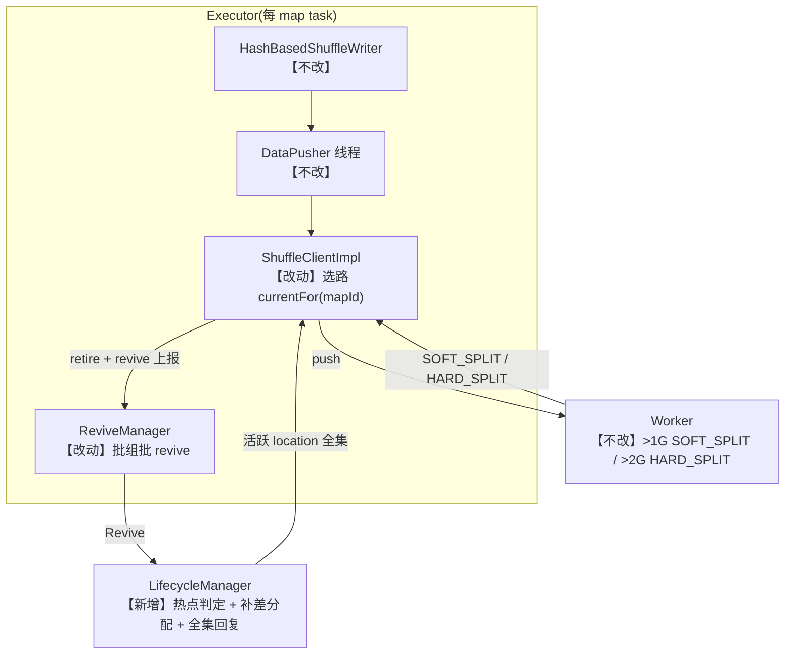

# CIP: Adaptive Partition Write Parallelism(自适应分区写并行)

> Status: Draft — Jira: TODO(待申请 CELEBORN-XXXX)
> Implementation: branch `adaptive-parallelism-write`

## Motivation

Celeborn reduce partition 的写路径是**单活跃 location**:一个 partition 任一时刻只有一个活跃 PartitionLocation,所有 map task 的数据都写它,写满后换下一个。这把单个 partition 的全部聚合写压集中到单点,在两类作业形态下成为瓶颈:

**场景一:极端倾斜 shuffle**。单个热 partition 承接远超平均的数据量,导致两类症状:

- **SOFT→HARD 窗口塌缩**:从 SOFT 阈值(默认 1G)到 HARD 上限(2G)的窗口随聚合写速成反比缩短,revive 与路由切换来不及完成就触发 HARD_SPLIT,写该 partition 的所有 map task 同步阻塞;
- **单点写瓶颈**:push RTT 升至秒级,mapper 线程被 push 队列反压顶住。在一个单 reduce partition、26090 mapper 的生产倾斜作业上实测:per-task shuffle writeTime p50 = 27.5s,而 task 总时长 p50 仅 30.6s——90% 的 task 时间在等写。

**场景二:shuffle 量大但 partition 数不足**。写并行度静态绑定于 partition 数;即使数据无倾斜,partition 数过少的作业其单 partition 聚合写速同样超出单 location 的承载能力,频繁 split 与 revive 等待拖慢整体写,而集群中大量 worker 的写能力闲置。

本特性把写并行度与静态 partition 数解耦:热点 partition 可并行写多个活跃 location,并行度由系统按实测写压闭环推出。

## Goals and Non-Goals

**Goals**:

- 热点 partition 可并行写多个活跃 location:mapper 按 `mapId % activeCount` 分散到各 location,单 location 写压与 SOFT→HARD 窗口同步改善;
- 并行度闭环自适应:无需人工设定,不对磁盘/worker 速度做任何先验假设;
- 不热的 partition 行为与现状完全一致;协议 additive,特性默认关闭。

**Non-Goals**:

- 所需并行度超过集群物理上限的极端倾斜——应由业务侧 salting/repartition 解决,与本特性互补(见 Risks and Limitations);
- 读路径改动(现有 fileGroups Set + 串流 + (mapId, attemptId, batchId) 去重天然兼容);
- 并行度降档与热点消散回收(见 Future Work)。

## Public Interfaces

**协议(proto3 向后兼容)**:`PbChangeLocationPartitionInfo` 新增一个 additive 字段:

```proto
repeated PbPartitionLocation additionalPartitions = 5;
```

`ReviveRequest` 无新增字段;internal 消息 `ChangeLocationResponse` 新增 `additionalLocs` 参数承载该字段;worker / master / Flink / cpp 协议面零改动。

**新增配置**(均在 client 侧,`celeborn.client.shuffle.adaptivePartitionWriteParallelism.*`):

| 配置 | 默认 | 说明 |
|---|---|---|
| `...adaptivePartitionWriteParallelism.enabled` | false | 总开关;关闭时所有路径与现状等价 |
| `...adaptivePartitionWriteParallelism.maxLocations` | -1 | 活跃 location 上限 = min(配置值, mapper 数);-1 = 仅按 mapper 数封顶;合法取值为 -1 或正数 |
| `...adaptivePartitionWriteParallelism.targetSplitInterval` | 60s | 单 location 从分配到 split 的目标耗时,即闭环控制的设定点(见设计决策 1) |

三个配置已同步登记到 `docs/configuration/client.md`。

**观测点**(一次性输出,不刷屏):LM 侧升档判定与分配结果;executor 侧并行激活与退休上报。

## Proposed Changes

### 数据流概览

术语约定:**退休(retire)** 指 client 将某个 (partition, epoch) 标记为不再承接新写、并把 cause 随 Revive 上报 LM;cause 包括 SOFT_SPLIT、HARD_SPLIT、push 失败与 worker 不可用。**revive** 沿用既有含义:client 向 LM 请求新 location 的 RPC。



读侧(reduce 端)零改动:`reducerFileGroups` 本就是 `Set<PartitionLocation>`,多文件串流与 (mapId, attemptId, batchId) 去重是既有能力。

### 关键设计决策

1. **split 事件驱动 + fillTime 实测,闭环控制而非开环估计**。split 阈值是固定字节数,在任何磁盘上含义相同;一个 location 从分配到写满所用的时间(fillTime)即换算出它的真实写速,HDD/SSD/混插集群各自自校准。`targetSplitInterval` 是闭环的设定点而非对硬件能力的假设:参数取值偏差只影响"要求多高",不影响正确性。

2. **升档公式 `desired = ceil(targetSplitInterval / fillTime)`,与当前路数解耦**。即目标路数 = 需要放慢的倍数。例:targetSplitInterval=60s、实测 2.2s 写满,则目标约 28 路。desired 单调递增、每 epoch 仅首报判定一次、由上限截断,一次判定直达目标,无需去抖。

3. **全集回复保证 executor 一致性**。每次 revive 响应携带该 partition 的完整活跃集(max epoch 为主回复 + `additionalPartitions`),所有 executor 一次 revive 即收敛到相同顺序的活跃列表,`mapId % K` 分派全局一致。若改为各 executor 异步收敛,收敛期内同一 mapId 在不同 executor 会写向不同 location。

4. **SOFT_SPLIT location 是一等路由目标,退休上报一条不丢**。soft 文件在 2G 硬上限前持续可写——若排除出路由,稳态下所有槽位都处于 soft 态,写压将塌缩回个别 location。同时 LM 靠每条退休上报维护活跃集,丢一条就会使补差分配失真。

5. **全不可写时回退到最新 location,与基线同形**。本地已知 location 全部不可写时,照常写入 max-epoch location(基线行为),由 worker 拒收驱动下一轮 revive;revive 请求发送时携带该 partition 全部未消化退休上报,LM 消化后一轮补满活跃集。若不带退休上报,LM 簿记中旧 location 仍标记为存活,补差 gap 归零,全部 mapper 挤向唯一可写 location,形成恶性循环。

### Executor-Side Design

**PartitionLocationGroup**:`reducePartitionMap` 的值类型,维护一个按 epoch 升序的活跃 location 列表,每条目带退休 cause 墓碑。未 split 的 partition 恒为单条目 fast path,写路径零额外开销。路由 `currentFor(mapId)`:收集可写子集(未退休 + SOFT_SPLIT)后按 mapId 均匀分派,同一 map task 稳定写同一 location;可写子集为空时回退到最新 location(见决策 5)。全集收敛:按 LM 回复的活跃集补齐缺失条目、绝不复活本地已退休 epoch、驱逐 LM 已消化的退休条目。

**ShuffleClientImpl 接入**:worker 对每个 push batch 返回状态码,两条写路径(pushData / mergeData)同形处理:

| 状态 | 行为 |
|---|---|
| SOFT_SPLIT | 数据已落盘,本地退休但保持可写,首次退休时上报 LM;mapper 线程无感 |
| HARD_SPLIT / push 失败 | 本地退休后走常规批量 revive:还有其他可写 location 时下一个调度 tick 本地满足(默认 100ms,零 RPC);否则由 LM 响应分配新 location |
| 全部不可写 | 回退写 max-epoch location,被拒后进入下一轮 revive(见决策 5) |

**ReviveManager**:单线程调度器按 shuffle 组批。可满足判定区分开关(adaptive 用"mapper 已结束或存在可写 location",基线用"mapper 已结束或更新 epoch 存在"),去重与响应处理与基线一致。退休上报在**发送时**从各 group 现取未消化退休集合:有界、自动去陈旧、RPC 超时丢失的条目随下一批自动重发。

**正确性**:

- batchId per-mapTask 全局单调,读侧 (mapId, attemptId, batchId) 去重不依赖 batch 在文件内的顺序,并行写与重推重复 batch 均安全;
- SOFT_SPLIT 语义下 worker 持续接收该文件写直到 2G 硬上限;
- speculation / rerun / stageEnd 后重跑:既有路径不变。

### LifecycleManager-Side Design

**handleRevive 分组处理**(flag 开启时):一条 Revive 先按 partition 分组——每组仅 max-epoch 条目走完整请求/分配路径,其余条目作为纯退休上报只做记账(注册 + 活跃集维护);响应完成计数按 distinct partition 计。批量 revive 因此可携带同 partition 的大量退休条目,而消息处理量正比于 distinct partition 数而非条目数。

**PartitionHotnessTracker**(独立可单测):per (shuffleId, partitionId) 维护活跃 epoch 集(soft 保留)、终态退休集(防迟到 SOFT 复活)、各 epoch 分配时刻、首报去重标记与单调递增的 desired。收到退休上报时:SOFT 且 worker 可用则保留在活跃集,其余移出(终态);fillTime = 首报时刻 − 分配时刻,若小于 targetSplitInterval 则按决策 2 的公式升档;push 失败类 cause 与不可用 worker 上的事件不计量。

**补差分配与回复**(`ChangePartitionManager`):

- desired 截断于 `cap = min(maxLocations, numMappers)`——路由是 `mapId % activeCount`,超过 mapper 数的 location 必然空转;
- gap = desired − 活跃数,逐次分配(epoch 递增,优先互不相同 worker,超出候选数后循环复用);登记使用 reserve 成功后的实际 epoch;
- 位于不可用 worker 的活跃 epoch 被过滤并终态退休;
- 每次回复携带活跃 location 全集(max epoch 为主,其余含 soft 为 additionals),即使本轮分配 0 个也回全集。

## 性能验证(生产个例)

作业形态:SparkSQL scan + shuffle + write;单 reduce partition 承接全部 26090 mapper,即本特性目标问题的最严苛形态。结论适用于该类倾斜负载,不做跨负载外推。

同一作业四组对照(输入 3.53TB,shuffle 写 9.37TB;作业耗时含读侧与调度噪声,写侧指标是主信号):

| 运行 | 写吞吐 (MB/s) | Shuffle 写线程总耗时 | Executor 运行总耗时 | vcore·h | 作业耗时 |
|---|---|---|---|---|---|
| 未开启 | 6.33 | 431h20m | 546.1h | 1128.7 | 40m47s |
| targetSplitInterval=10s | 391.75 | 6h58m | 177.8h | 433.9 | 7m23s |
| targetSplitInterval=30s | 552.66 | 4h56m | 170.9h | 504.6 | 8m08s |
| targetSplitInterval=60s(默认) | 648.97 | 4h12m | 167.5h | 403.3 | 6m34s |

targetSplitInterval 通过公式 `desired = ceil(targetSplitInterval / fillTime)` 直接定义目标路数:10s/30s/60s 分别对应约 100/34/17 MB/s 的单路均衡写速,值越大目标并行度越高。收益来自三处:SOFT→HARD 安全窗随路数拉宽(60s 组几乎零重推零阻塞,重推是重复写,这是写线程总耗时阶梯的主因);写压分摊到更多 location,push RTT 与排队下降;热点判定要求 fillTime 小于该值,小间隔目标低、封顶早。代价:热点 partition 的并发 location 变多,槽位与磁盘占用同比例放大(见 Risks and Limitations)。

注:基线写吞吐 6.33 MB/s 反映的是严重反压下 mapper 大部分时间阻塞,而非磁盘上限。

## Compatibility, Deprecation, and Migration Plan

- **纯 additive,默认关闭**:`enabled=false` 时所有路径与现状等价;proto 仅新增一个 repeated 字段,无字段复用、无语义变更。
- **新 client → 老 LM**:拿不到 additionals,退化为单 location 写,无异常。
- **老 client → 新 LM**:忽略未知字段;LM 热点判定照常,只是老 client 不使用多 location。
- **Rollout**:先升级全部 LM(driver 侧随作业提交,与 executor 同包,天然同版本),再开启开关。**Rollback**:开关置回 false 即恢复单 location 写,已产生的多 location 文件读侧天然兼容。
- 无 deprecation;单 location 路径保留为默认。

## Test Plan

- `PartitionLocationGroupSuiteJ`:快路径、soft 参与路由 / hard 排除、cause 升级、全集收敛与清理、乱序 epoch、并发路由与合并、未消化退休视图;
- `ReviveManagerSuiteJ`:批量路径退休上报的发送时现取(去重、丢弃陈旧 epoch);
- `ShuffleClientSuiteJ`:adaptive 可满足判定(hasWritableLocation);
- `PartitionHotnessTrackerSuite`:计量守卫、目标与活跃数解耦、fillTime 下限与上限截断、单调不降、soft 保留/移除、迟到 SOFT 不复活;
- `ChangePartitionManagerAdaptiveParallelismSuite`:升档与补差分配、gap 超候选数循环叠放、allocTime 未知保守、首报去重、gap=0 仍回全集、并发 revive 收敛、同 partition 多条目分组;
- `RequestLocationCallContextSuite`:同 partition 重复回复忽略、按 distinct 数完成响应。

回归:特性关闭时既有 client/LM 套件全绿;生产灰度作业开启前后对比(见性能验证)。

## Rejected Alternatives

- **split 计数 × 静态速率配置(开环估计)**。并行度 = 观测速度 ÷ 假设速度,假设错了结果直接错且无反馈纠正;worker 真实速度随集群负载与异构硬件高度动态,任何静态值都不可能正确。此外以 split 事件计数为信号与 split 阈值配置耦合——阈值 1G 与 10G 下同样的写速产生完全不同的事件率,阈值一大判定即失敏。本设计的闭环方案中,"每个 location 存活 ≥ targetSplitInterval"的时间制语义与阈值无关:阈值大 10 倍则每路装得多 10 倍、所需路数自动少 10 倍。

- **worker/client 侧速率统计(替代 split 事件驱动)**。client 侧单 mapper 只见自己的流,聚合速率只有 LM 能算,需要新上报通道;push 字节/时间含排队与 flush 周期噪声,需要平滑窗口,而平滑会重新引入检测延迟。worker 侧方案需要把补丁面从 1 个 additive proto 字段扩到 worker/protocol/LM 三层。净收益仅为检测延迟可低于"写满一个阈值",不足以抵消补丁面扩张,故列为 Future Work 的信号源替换。

- **业务侧 salting / repartition**。把倾斜 key 打散到多个 reduce partition,有效但要求改作业、且读侧与下游语义变化;对"所需并行度超过集群 worker 数"的极端场景仍是唯一根治手段。本特性与它互补:特性解决系统侧的检测与并行写自动化,salting 解决超出集群物理上限的倾斜。

## Risks and Limitations

1. **检测延迟 = 写满一个 threshold**:首次判定要等某个 location 写满一个 split 阈值;滞后期间等价于现状,不会更差;
2. **desired 只升不降**:一次误判在整个 shuffle 生命周期不可回退,后果由上限封顶;
3. **split 事件率与并行度无关**:所需并行度远超集群 worker 数的作业超出本特性能力范围,应业务侧 salting/repartition;
4. **资源占用放大**:热点 partition 的槽位与磁盘占用按路数 K 倍放大(K ×(replicate 则 ×2)× partitionSplitMaximumSize),分摊在该 shuffle 既有 worker 集合内(不新增 worker,集合大小由 `celeborn.client.slot.assign.maxWorkers` 约束);文件数增多也使 commit 体量与读侧文件流相应增加;
5. **AQE skew read / StageEnd commit 变长**:理论兼容,上线前需 IT 回归;
6. **HARD_SPLIT 成因异质**:写满阈值、worker 退役、磁盘空间不足、文件已提交都会触发 HARD_SPLIT 且响应不区分成因;运维性 split 理论上可能被误判为热点而抬升 desired,方向保守且由上限封顶,但噪声非零,成因细分列入 Future Work。

## Future Work

- worker/client 侧速率统计作为信号源替换:检测延迟降到 10~20s、与 split 阈值解耦,fillTime→目标换算、全集收敛、活跃集记账全部复用;
- 重推换路零延迟:HARD_SPLIT/失败时若另有可写 location,预置成功状态让重推线程立即换路,省一个 revive tick;
- 并行度降档与热点消散回收;
- HARD_SPLIT 成因细分:独立 StatusCode 或响应携带文件长度,使热点判定只计量写压驱动的 split;
- worker 过载主动上报:worker 检测所承载 location 的入向写速过载时,主动请求提升该 partition 并行度,同时作为保护 shuffle 服务的稳定性手段;
- 补充验证:多热点 partition 并存场景、非默认 split 阈值下的行为、读侧影响回归(AQE skew read、StageEnd commit 耗时)。
