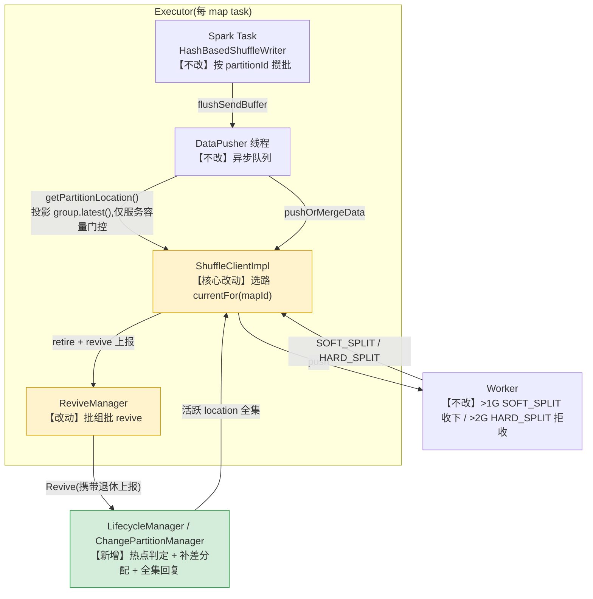
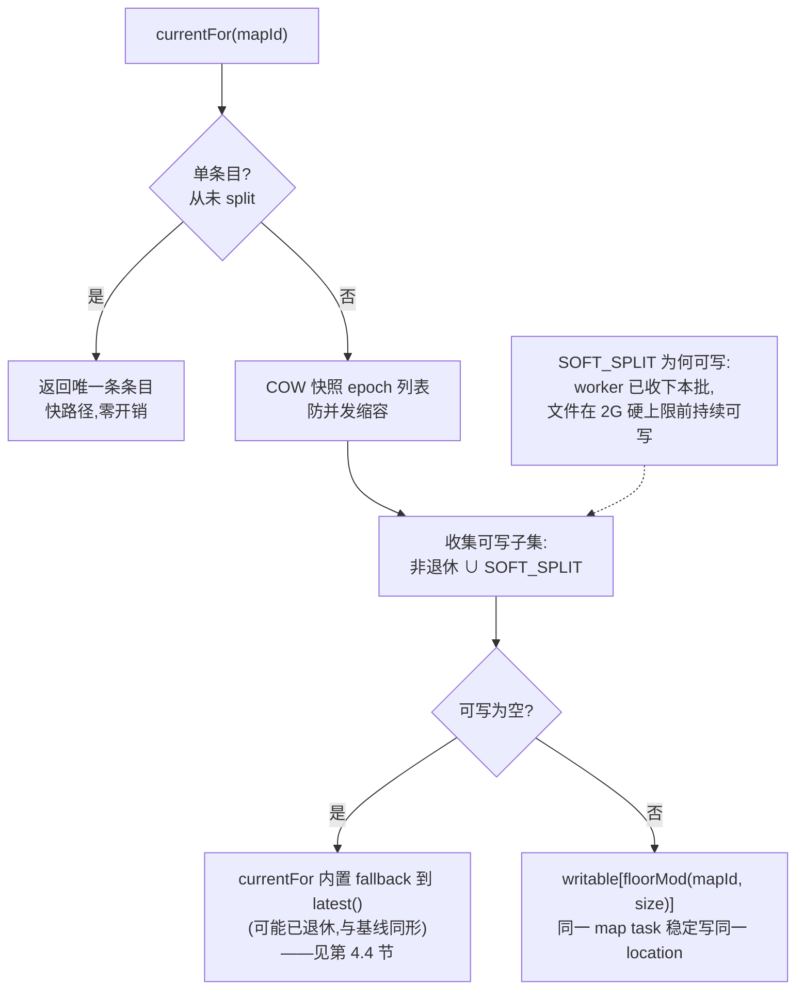
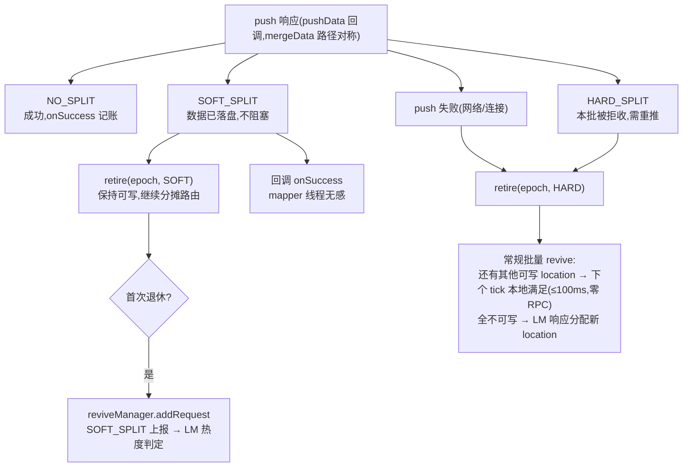
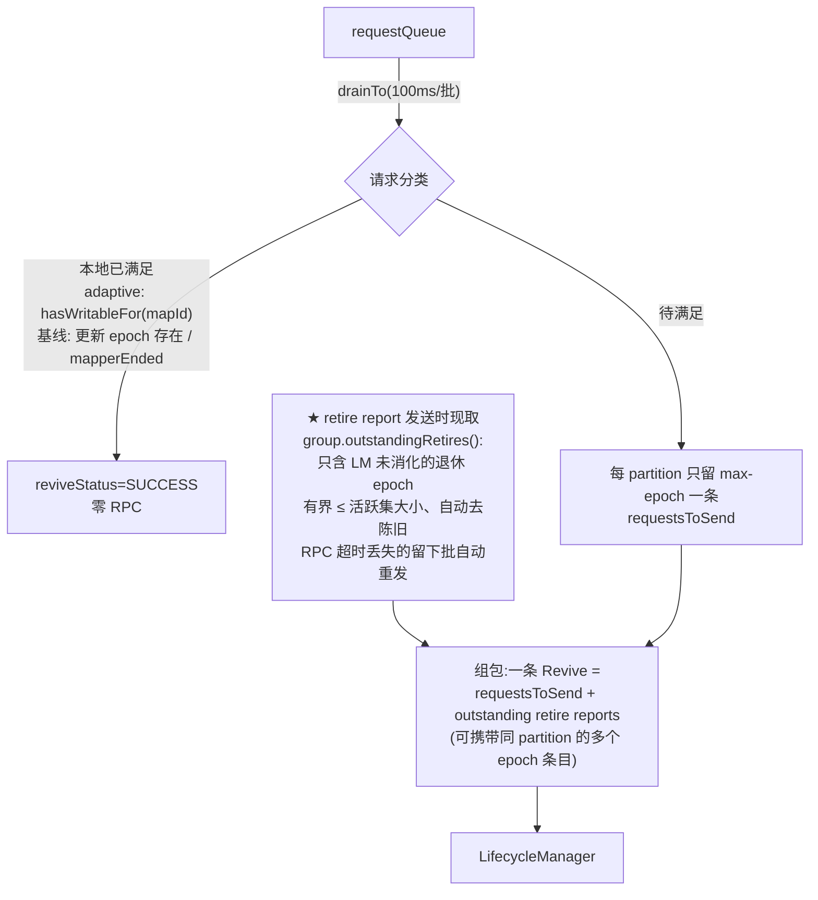
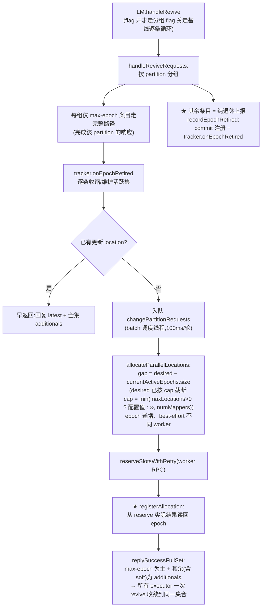

# Code Review 指引:adaptive partition write parallelism

> 分支 `adaptive-parallelism-write`,基线 `origin/main`,18 文件 +2691/−71,共 33 个 commit。
> 面向第一次接触本特性的 reviewer。**建议先读 `dynamic-partition-write-parallelism-design.md`(200 行)**,
> 本文按"一条数据从 mapper 到 worker 的旅程"组织代码阅读路径。

```bash
git fetch origin && git checkout adaptive-parallelism-write
git diff origin/main HEAD --stat
```

commit 分三类看:

| 类别 | 代表 commit | 审读方式 |
|---|---|---|
| 特性本体 | `c8e489453` | 主审对象:选路 / retire / revive / 热点判定 / 全集收敛 / 协议 / 配置 |
| 纯瘦身 | `67828962f` | **不含任何逻辑改动**:删纯诊断代码与冗余封装。抽查 diff 确认即可 |
| 灰度事故驱动的修复链 | 其后提交(见 `git log`) | 每个修复对应本文一个思考题(Q3/Q4/Q5/Q9),建议结合思考题审 |

---

## 总览:改了什么、没改什么



读侧(reduce 端)零改动:`reducerFileGroups` 本就是 `Set<PartitionLocation>`,多文件串流 + (mapId, attemptId, batchId) 去重是既有能力。

> **FAQ:为什么图上两处用了不同方法(`latest()` vs `currentFor(mapId)`)?**
> 职责不同。`currentFor(mapId)` 是**数据选路**:在可写子集上 `mapId % writableCount` 分摊写压,决定这批字节写到哪个文件。而三参 `getPartitionLocation()` 投影的 `latest()`(max-epoch 代表)只服务 **per-worker 容量门控**——它在生产代码里的唯一调用方是 `DataPushQueue.takePushTasks`,且只消费 `loc.hostAndPushPort()` 去查 `pushState.remainingAllowPushes(...)`(per-worker 在途配额的拥塞控制):配额 > 0 才把 task 取出交给 DataPusher,否则 sleep 等待,等满 `takeTaskMaxWaitAttempts` 次强制取一个兜底。它决定的是"现在放不放行这个 task",**不决定数据写哪**。
>
> 这没有破坏旧链路语义:
>
> - **开关关闭时**:group 恒为单条目 fast path,`latest()` 返回唯一条条目,与基线 `map.get(partitionId)` 严格等价;
> - **开关打开时**:max-epoch 代表可能把 task 记到非实际推送 worker 的配额上,但这只是**有界近似流控**而非正确性问题——基线本来就是近似的(take 到 push 之间 location 可能已被 revive 换掉,基线同样会记错账),卡住的风险由等待次数兜底,push 前还有一道用真实 loc 的 `limitMaxInFlight` 二次门控;
> - 另一细微差别:基线返回内部活 map 的引用,现在返回每次调用新投影的拷贝;`takePushTasks` 每轮循环都重新调用,行为无差别。
>
> 保持单值投影也维持了 `ShuffleClient.getPartitionLocation` 的 API 兼容。

---

## 第 1 站:writer 入口(确认哪些没改,10 分钟)

文件:`client-spark/spark-3/src/main/java/org/apache/spark/shuffle/celeborn/HashBasedShuffleWriter.java`

看三个点,确认 writer 对多 location **无感知**(Spark 集成层零改动是本特性的硬约束):

1. `write()` 攒批到 `sendBuffers[partitionId]`——writer 只按 partitionId 组织数据;
2. `flushSendBuffer` → `dataPusher.addTask(partitionId, ...)`——数据按 partitionId 进异步队列;
3. `close()` → `pushMergedData` + `mapperEnd`——收尾流程不变。

> 数据"按 partitionId"进入 client,那"一个 partition 写多个 location"的决策必然发生在 client 内部——这就是下一站。

---

## 第 2 站:选路(executor 核心,40 分钟)

### 2.1 从 pushOrMergeData 开始

文件:`client/src/main/java/org/apache/celeborn/client/ShuffleClientImpl.java`,搜 `currentFor(mapId)`:

```java
// 改造前(单活跃 location):
PartitionLocation loc = map.get(partitionId);            // 单值
// 改造后:
PartitionLocation currentLoc = group.currentFor(mapId);  // mapId % 可写数
```

路由流程(`PartitionLocationGroup.currentFor`):



> **Q1:为什么 SOFT_SPLIT 的 location 必须参与路由而不是只做兜底?**
> 稳态下几乎所有槽位都会处于 soft 态(文件 1G~2G 窗口内);若排除 soft,所有 map 的取模起点落空后会 bump 到同一个最新 location,写压塌缩回串行(线上实证过)。这是设计文档 Proposed Changes · 决策 4。

> **Q2:可写数变化时 mapId 的映射会偏移,数据会不会乱?**
> 会换 location,但不影响正确性——batchId 是 per-mapTask 全局单调的,读侧按 (mapId, attemptId, batchId) 去重,不依赖 batch 落在哪个文件。

### 2.2 PartitionLocationGroup(建议通读)

结构:按 epoch 升序的 COW `EpochState{location, cause}` 列表(cause 即退休墓碑)+ `volatile maxEpoch`;未 split 的 partition 恒为单条目 fast path。关键方法:

| 方法 | 语义 | 并发手段 |
|---|---|---|
| `currentFor` | 上图路由(可写为空时 fallback `latest()`) | COW 快照,无锁 |
| `hasWritableFor` | 是否存在可写 location(批调度器"本地可满足"判定) | COW 快照,无锁 |
| `latest()` | max-epoch 代表(单值语义所需处:容量门控投影、revive 请求的锚定 location) | COW 快照 |
| `retire(epoch, cause)` | 退休;cause 可升级(SOFT→HARD)不可降级 | synchronized(首报信号原子) |
| `merge` | 按 LM 全集收敛;清理已消化退休 | synchronized |
| `replace` | 单值 legacy 更新(flag 关闭 / 单 location 响应) | synchronized |
| `outstandingRetires()` | 未消化退休上报快照(仍在列表中且带 cause 的条目),供批调度器发送时携带 | COW 快照,无锁 |

配套测试(读测试是最快的语义确认):`PartitionLocationGroupSuiteJ` 8 例——先读 `testSoftSplitStaysWritableHardSplitExcluded` 和 `testRetireCauseUpgrade`。

---

## 第 3 站:push 响应处理与 retire(20 分钟)

worker 对每个 push batch 返回一个状态码。回到 `ShuffleClientImpl`,搜 `SOFT_SPLIT.getValue()`:



> 注:pushData 与 mergeData 两条路径同形——构造 ReviveRequest(mergeData 用 `addAndGetReviveRequests`)→ `reviveManager.addRequest` → flag 开时随即 `retireEpoch(...)` 本地退休,路由立即绕开。曾有一版"预置 reviveStatus=SUCCESS 让重推零延迟换路"的优化,调查后确认只是省 ≤1 个 revive tick(~100ms/批,且发生在后台重推线程),已从 v1 移除并记入设计文档 Future Work;生产灰度对照实测移除前后性能无差异。

---

## 第 4 站:revive 全流程(最复杂的一条链,40 分钟)

### 4.1 常规路径:ReviveManager 批量调度

文件:`client/src/main/java/org/apache/celeborn/client/ReviveManager.java`(单线程调度器,默认 100ms 一批):



代码结构上保持基线单循环不做重构,开关只加在语义真正有差异的三处:可满足判定(adaptive 用 `hasWritableFor`,基线用 `newerPartitionLocationExists || mapperEnded`)、已满足请求的 `mapIds` 收集、以及循环后开关守卫的退休上报附包段;`filteredRequests`/`requestsToSend` 去重与响应处理段完全共享,与基线逐行一致。

> **Q3(关键不变量):为什么"本地已满足"的请求也必须把退休上报转发给 LM?**
> LM 的活跃集记账**唯一输入**就是退休上报。若丢弃"已满足"的上报:LM 认为该 epoch 仍活跃 → surviving ≥ desired → gap=0 永不分配新 location → executor 全部退休后拿不到可写 location → `Partition location is NULL!` task 失败(线上真实事故)。一句话:**退休上报一条都不能丢**。

> **Q4(另一个关键不变量):为什么"已满足"用可写性(`hasWritableFor(mapId)`)而不是"存在更新 epoch"?**
> "存在更新 epoch"不等于"可写"——更新的 epoch 可能同样已退休。用后者判定:revive 成功却拿到死位置 → 必被拒 → 再 revive → 再被短路,批次在本地陈旧视图上自旋,LM 收不到新信息、永不分配(线上性能事故)。SUCCESS 必须意味着"有可写 location",不可写就必到 LM。注意 `currentFor` 内置 fallback 后不再返回 null,不能用它做可写性判定——这正是 `hasWritableFor` 单独存在的原因。

### 4.2 LM 侧:handleRevive → 判定 → 分配 → 全集回复

文件:`client/src/main/scala/org/apache/celeborn/client/ChangePartitionManager.scala` + `PartitionHotnessTracker.scala`:



> **Q5:为什么上报条目不能各自走完整请求路径?**
> 完整路径每条都要拿条纹锁、查 latest、扫 worker 快照装全集。积压客户端一条 Revive 可携带同 partition 上千条上报(批调度被超时 RPC 堵住后的积压),逐条走完整路径把 LM dispatcher 拖到秒级/条、队列排队 77s > 客户端 60s askTimeout → 大面积 revive 超时(线上实证:slow rpc queueSize 1800+)。分组后每条消息的处理量正比于 distinct partition 数而非条目数;响应完成计数相应按 distinct partition 计,两者必须同时生效,否则响应永不完成。

> **Q6:登记为什么要从 reserve 结果读回 epoch,而不是用分配时算好的计划?**
> `reserveSlotsWithRetry` 失败重试会用不同 epoch 重分。若按事前计划记账:实际 location 与记账不符 → 该 location 永不出现在全集里(槽位泄漏),计划里被顶掉的 epoch 留在活跃集里(幻影 epoch 压 gap)。这是评审核查确认过的真 bug 修复。

### 4.3 热点判定:desired 怎么涨(tracker 核心,一段代码)

`PartitionHotnessTracker.onEpochRetired` 计量分支(SOFT/HARD 且 worker 可用):

```scala
fillTimeMs = max(1ms, now - allocTime(epoch))          // 该 location 从分配到写满 1G 的实测时长
target = ceil(targetSplitInterval / fillTimeMs)        // 与当前路数无关
desired = min(cap, target)                             // 单调递增,每 epoch 只判一次
```

> **Q7:为什么不乘当前路数 K?**
> 乘 K 的正确性依赖"固定总吞吐、按 K 均摊"模型(fillTime 应随 K 线性变长)。实测判定该模型不成立:单 location 写速存在磁盘/管道地板,fillTime 不随 K 摊薄(同一作业 K=36 与 K=607 时 fillTime 同为 ~2.2s)。该模型下乘 K 构成正反馈——target ∝ K、K 跟随 desired——生产实测一路放大到 16653(36→949→…→607→16653),远超并发写者数(~2000),超出部分全是空转槽位。去掉 K 后目标与 K 解耦,fillTime 为常数则目标为常数,反馈消失;上述场景稳定在 ~28 路,与 maxLocations=30 的实测最优一致。
> 配套测试:`PartitionHotnessTrackerSuite` 的 `fillTime measured under a larger active set does not scale the target` 与 `constant fillTime yields a constant target as the active set grows`(回归:活跃集膨胀不再放大 desired)。

> **Q8:为什么是 split 事件驱动,而不是 worker/client 速率统计?**
> split 阈值(默认 1G)是**字节尺子**不是速度假设——任何磁盘介质上"写满 1G"含义一致,fillTime 把它换算成实测速率,HDD/SSD/混插各自自校准(这正是 PR#3260 `expectedWorkerSpeed=10MB/s` 魔数被评审质疑的点)。检测延迟 = 阈值/聚合速率,与热度成反比、方向自适应。速率统计的净收益只有"检测更快 + 与阈值解耦",代价是 client 只见局部流需新上报通道、worker 需 per-partition 仪表化,且判定"热"仍要一个 SLO 阈值(量纲恰等于 阈值/targetSplitInterval)。完整对比见设计文档 Rejected Alternatives。

### 4.4 全不可用路径:currentFor 内置 fallback 到 latest()(与基线同形)

全不可用(所有已知 location 均已本地退休)由 `currentFor` 一处处理:可写子集为空时返回 `latest()`(max-epoch,可能已退休),入口和两条重推路径都只是普通地调 `currentFor`——照推 max-epoch location,由 worker 拒收驱动下一轮 revive。代码形态:

```java
PartitionLocation newLoc = reducePartitionMap.get(shuffleId).get(partitionId).currentFor(mapId);
```

> **为什么 `reducePartitionMap.get(...)` 不判 null、拿不到可写 location 也不报错?**
> 这正是基线的写法:基线是 `reducePartitionMap.get(shuffleId).get(partitionId)` 直接取——shuffle 在注册时已 put,重推路径触发前必然有值,基线从未判过 null;基线也从不检查拿到的 location 是否已死,照推、由 worker 拒收驱动 revive。本 PR 只把"取 location"从单条记录换成 group 路由,fallback 内置在 `currentFor` 里(可写集为空时返回 `latest()`,即基线语义下"当前那条 location")——行为与基线逐点对应,不引入基线没有的判空、报错或等待逻辑。
>
> **fallback 什么时候触发?** `currentFor` 把 mapId 散到当前**可写**(非退休 + SOFT_SPLIT)的 location 上;只有当这个 partition 所有已知 location 都被本地退休(可写集为空)时才走 fallback。"可写集为空"这个状态基线里不存在——基线从不本地退休 location,永远有一条(可能已死的)可推;本特性把退休变成本地显式状态后才第一次看到它。fallback 到 `latest()` 恰好就是回到基线那条"可能已死的 location",被拒后进入下一轮 revive,与基线自愈路径完全重合。注意:fallback 使 `currentFor` 不再返回 null,需要真实可写性判定的地方(批调度器"本地可满足"检查)用 `hasWritableFor(mapId)`。

这与基线"从不本地退休、照推可能已死的 location"完全同形——fallback 在任何场景都不劣于基线;自愈依赖批调度器的发送时携带退休上报(§4.1)与每 partition 在飞请求去重,无需额外的等待/重试机制。

> **Q9:为什么不阻塞等待 LM 分配新 location?**
> 早期版本在入口用过阻塞 revive(等"可写"谓词)、重推路径用过 re-enqueue;再早期纯 fallback 版本曾实测吞吐退化——后定位为 revive 风暴(批调度被超时 RPC 堵住 + 上报从队列无界积压)的次生症状,而非 fallback 本身。风暴修复后复测:两个机制在热点负载下均为零命中——SOFT(1G)首报即触发升档,HARD(2G)时活跃集已有多路,可写集不会空;K=1 冷 partition 的窗口期 fallback 与基线行为完全一致,白跑量可忽略。没有证据支持的独有机制,删除。

---

## 第 5 站:协议、配置与测试(20 分钟)

**协议**(一个 additive 字段):

```bash
git diff origin/main HEAD -- common/src/main/proto/TransportMessages.proto \
  common/src/main/scala/org/apache/celeborn/common/protocol/message/ControlMessages.scala
```

`additionalPartitions = 5`(repeated):老 LM 不返回 → 退化为单 location;老 client 忽略未知字段。注意 executor↔LM 是 driver/executor 同 jar 的应用内消息,不存在混合版本部署。

**配置**(默认关闭):

| key | 默认 | 语义 |
|---|---|---|
| `...adaptivePartitionWriteParallelism.enabled` | false | 总开关;关闭时全路径与基线等价 |
| `...maxLocations` | -1 | 活跃 location 上限 = min(配置值, numMappers);-1 = 仅按 mapper 数(路由 mapId % K,超过 mapper 数必空转,天然上限) |
| `...targetSplitInterval` | 60s | 单 location 从分配到 split 的目标耗时(SLO:写满 1G 不应快于该值;稳态下 partition 相邻两次 split 的间隔收敛到该值) |

**跑测试**(~2 分钟):

```bash
./build/mvn -pl client -Dtest='PartitionLocationGroupSuiteJ,ShuffleClientSuiteJ,ReviveManagerSuiteJ' \
  -DwildcardSuites='org.apache.celeborn.client.PartitionHotnessTrackerSuite,org.apache.celeborn.client.ChangePartitionManagerAdaptiveParallelismSuite,org.apache.celeborn.client.RequestLocationCallContextSuite' test
```

读测试顺序建议:tracker(12,判定规格)→ group(8,路由/退休/收敛)→ ReviveManager(1,批组批重建退休上报)→ CPM(6,判定+分配+全集集成+Revive 分组)→ context(1,多 epoch 响应合并)。

---

## Review 检查清单

- [ ] **开关关闭等价性**:搜每个 `adaptivePartitionWriteParallelismEnabled` 分支,基线路径走原逻辑(handleRevive 逐条循环、updateLatestPartitionLocations 的 put、registerCommitPartitionRequest 直调);
- [ ] **瘦身 commit 等价性**:`git show 67828962f`,抽查被删/被合并的代码块,确认只动了日志、统计、测试专用方法和重复封装,flag 分支与判定逻辑未变;
- [ ] **并发安全**:group 的三类访问线程(push / push 回调 / ReviveManager 调度器)——哪些在 monitor 内,哪些靠 COW/CHM;每 partition 在飞 revive 请求由调度器去重;
- [ ] **退休上报不丢**:ReviveManager 的每个丢弃分支,确认 adaptive 开启时都转成了 report(Q3);
- [ ] **槽位不泄漏**:登记与全集装配都从 reserve 实际结果 / worker snapshots 读回(Q6);
- [ ] **极端值**:fillTime=0 有 1ms 下限;gap 循环 candidates 耗尽即停;desired 封顶;
- [ ] **epoch 语义未变**:`latestPartitionLocation` 仍是单值 max-epoch(与 PR#3260 重用 epoch 做并行度刻度的关键差异);
- [ ] **读侧零改动**:多 location 的读正确性完全依赖既有 (mapId, attemptId, batchId) 去重。

## 性能佐证(设计文档 Proposed Changes · 性能验证)

生产作业:单 reduce partition 承接 26090 mapper(输入 3.53TB,shuffle 写 9.37TB),同作业四组对照:

| 组别 | shuffle 写吞吐 | 写线程总耗时 | executor 总耗时 | 作业耗时 |
|---|---|---|---|---|
| 未开启 | 6.33 MB/s | 431h20m | 546.1h | 40m47s |
| targetSplitInterval=10s | 391.75 MB/s | 6h58m | 177.8h | 7m23s |
| targetSplitInterval=30s | 552.66 MB/s | 4h56m | 170.9h | 8m08s |
| targetSplitInterval=60s(默认) | 648.97 MB/s | 4h12m | 167.5h | 6m34s |

读代码时可对照数据流定位每个机制的贡献:写压分摊消除反压(§2 路由)、SOFT 不阻塞 + 批量 revive 本地满足换路(§3)、无 NULL 失败(§4)。
